<!-- GENERATED FILE — do not hand-edit. Regenerate with:
     .venv/bin/python utils/gen_data_dictionary.py
     Source: backend/db.py's DDL (schema) + backend/sources.py (provenance/cadence/rate-limit)
     + frontend/src/data_editorial.js (per-field prose, where available). -->

# ArgentVigil Data Dictionary

31 tables. Generated field lists are mechanical (from SQLite's own schema); per-field descriptions are pulled from data_editorial.js where hand-written, or marked `<!-- TODO: describe field -->` where they are not yet documented.

## `census_trade`

**Source**: U.S. Census Bureau — International Trade (`census_trade`, gov_regulatory)  
**Cadence**: `startup`  
**Rate limit**: ~25-day minimum gap between fetch attempts  

| Field | Type | PK | Description |
|---|---|---|---|
| `metal` | TEXT | ✓ | <!-- TODO: describe field --> |
| `flow` | TEXT | ✓ | <!-- TODO: describe field --> |
| `hs_code` | TEXT | ✓ | <!-- TODO: describe field --> |
| `cty_code` | TEXT | ✓ | <!-- TODO: describe field --> |
| `cty_name` | TEXT |  | <!-- TODO: describe field --> |
| `year` | INTEGER | ✓ | <!-- TODO: describe field --> |
| `month` | INTEGER | ✓ | <!-- TODO: describe field --> |
| `value_general_usd` | INTEGER |  | <!-- TODO: describe field --> |
| `value_consumption_usd` | INTEGER |  | <!-- TODO: describe field --> |
| `qty` | REAL |  | <!-- TODO: describe field --> |
| `qty_unit` | TEXT |  | <!-- TODO: describe field --> |
| `fetched_at` | TEXT |  | <!-- TODO: describe field --> |

## `cot_disaggregated`

**Source**: CFTC Commitment of Traders (Legacy + Disaggregated) (`cot_pipeline`, gov_regulatory)  
**Cadence**: `manual_only`  
**Rate limit**: ~7-day minimum gap between fetch attempts  

| Field | Type | PK | Description |
|---|---|---|---|
| `report_date` | TEXT | ✓ | <!-- TODO: describe field --> |
| `metal` | TEXT | ✓ | <!-- TODO: describe field --> |
| `category` | TEXT | ✓ | <!-- TODO: describe field --> |
| `long` | REAL |  | <!-- TODO: describe field --> |
| `short` | REAL |  | <!-- TODO: describe field --> |
| `spreading` | REAL |  | <!-- TODO: describe field --> |
| `open_interest` | REAL |  | <!-- TODO: describe field --> |

## `cot_gold`

**Source**: CFTC Commitment of Traders (Legacy + Disaggregated) (`cot_pipeline`, gov_regulatory)  
**Cadence**: `manual_only`  
**Rate limit**: ~7-day minimum gap between fetch attempts  

| Field | Type | PK | Description |
|---|---|---|---|
| `report_date` | TEXT | ✓ | <!-- TODO: describe field --> |
| `noncomm_long` | REAL |  | <!-- TODO: describe field --> |
| `noncomm_short` | REAL |  | <!-- TODO: describe field --> |
| `open_interest` | REAL |  | <!-- TODO: describe field --> |
| `net_long` | REAL |  | <!-- TODO: describe field --> |
| `net_long_pct_oi` | REAL |  | <!-- TODO: describe field --> |
| `fetched_at` | TEXT |  | <!-- TODO: describe field --> |

## `cot_prices`

**Source**: CFTC Commitment of Traders (Legacy + Disaggregated) (`cot_pipeline`, gov_regulatory)  
**Cadence**: `manual_only`  
**Rate limit**: ~7-day minimum gap between fetch attempts  

| Field | Type | PK | Description |
|---|---|---|---|
| `ticker` | TEXT | ✓ | <!-- TODO: describe field --> |
| `date` | TEXT | ✓ | <!-- TODO: describe field --> |
| `price` | REAL |  | <!-- TODO: describe field --> |

## `cot_silver`

**Source**: CFTC Commitment of Traders (Legacy + Disaggregated) (`cot_pipeline`, gov_regulatory)  
**Cadence**: `manual_only`  
**Rate limit**: ~7-day minimum gap between fetch attempts  

| Field | Type | PK | Description |
|---|---|---|---|
| `report_date` | TEXT | ✓ | <!-- TODO: describe field --> |
| `noncomm_long` | REAL |  | <!-- TODO: describe field --> |
| `noncomm_short` | REAL |  | <!-- TODO: describe field --> |
| `open_interest` | REAL |  | <!-- TODO: describe field --> |
| `net_long` | REAL |  | <!-- TODO: describe field --> |
| `net_long_pct_oi` | REAL |  | <!-- TODO: describe field --> |
| `fetched_at` | TEXT |  | <!-- TODO: describe field --> |

## `delivery_notices`

**Source**: Delivery Notices (`delivery_notices`, exchange_market)  
**Cadence**: `interval`, every 1200s  
**Rate limit**: undocumented — advisory only  

| Field | Type | PK | Description |
|---|---|---|---|
| `date` | TEXT | ✓ | <!-- TODO: describe field --> |
| `type` | TEXT | ✓ | <!-- TODO: describe field --> |
| `daily_issued` | REAL |  | <!-- TODO: describe field --> |
| `daily_stopped` | REAL |  | <!-- TODO: describe field --> |

## `event_calendar`

**Source**: CATCOR — ForexFactory Consensus + ALFRED Actuals (`catcor_consensus_actuals`, calendar_events)  
**Cadence**: `interval`, every 1800s  
**Rate limit**: undocumented — advisory only  

| Field | Type | PK | Description |
|---|---|---|---|
| `event_id` | TEXT | ✓ | <!-- TODO: describe field --> |
| `event_name` | TEXT |  | <!-- TODO: describe field --> |
| `event_type` | TEXT |  | <!-- TODO: describe field --> |
| `scheduled_time` | TEXT |  | <!-- TODO: describe field --> |
| `consensus_value` | REAL |  | <!-- TODO: describe field --> |
| `actual_value` | REAL |  | <!-- TODO: describe field --> |
| `surprise_delta` | REAL |  | <!-- TODO: describe field --> |
| `source_url` | TEXT |  | <!-- TODO: describe field --> |
| `source_tier` | TEXT |  | <!-- TODO: describe field --> |

## `forexfactory_calendar`

**Source**: CATCOR — ForexFactory Consensus + ALFRED Actuals (`catcor_consensus_actuals`, calendar_events)  
**Cadence**: `interval`, every 1800s  
**Rate limit**: undocumented — advisory only  

| Field | Type | PK | Description |
|---|---|---|---|
| `week_key` | TEXT | ✓ | <!-- TODO: describe field --> |
| `title` | TEXT | ✓ | <!-- TODO: describe field --> |
| `country` | TEXT | ✓ | <!-- TODO: describe field --> |
| `event_date` | TEXT | ✓ | <!-- TODO: describe field --> |
| `impact` | TEXT |  | <!-- TODO: describe field --> |
| `forecast` | TEXT |  | <!-- TODO: describe field --> |
| `previous` | TEXT |  | <!-- TODO: describe field --> |

## `fred_observations`

**Source**: FRED — Money Supply (M2, WALCL, Composition) (`money_supply`, gov_regulatory)  
**Cadence**: `startup`  
**Rate limit**: undocumented — advisory only  

| Field | Type | PK | Description |
|---|---|---|---|
| `series_id` | TEXT | ✓ | <!-- TODO: describe field --> |
| `date` | TEXT | ✓ | <!-- TODO: describe field --> |
| `value` | REAL |  | <!-- TODO: describe field --> |

## `futures_curve_spread`

**Source**: Futures Curve Spread (`futures_curve_spread`, exchange_market)  
**Cadence**: `interval`, every 1200s  
**Rate limit**: undocumented — advisory only  

| Field | Type | PK | Description |
|---|---|---|---|
| `metal` | TEXT | ✓ | <!-- TODO: describe field --> |
| `date` | TEXT | ✓ | <!-- TODO: describe field --> |
| `front_month_symbol` | TEXT |  | <!-- TODO: describe field --> |
| `front_month_price` | REAL |  | <!-- TODO: describe field --> |
| `next_month_symbol` | TEXT |  | <!-- TODO: describe field --> |
| `next_month_price` | REAL |  | <!-- TODO: describe field --> |
| `curve_spread_pct` | REAL |  | <!-- TODO: describe field --> |
| `fetched_at` | TEXT |  | <!-- TODO: describe field --> |

## `gold_inventory_aggregate`

**Source**: Comex Gold History (`comex_gold_history`, exchange_market)  
**Cadence**: `interval`, every 1200s  
**Rate limit**: undocumented — advisory only  

| Field | Type | PK | Description |
|---|---|---|---|
| `date` | TEXT | ✓ | <!-- TODO: describe field --> |
| `total` | REAL |  | <!-- TODO: describe field --> |
| `registered` | REAL |  | <!-- TODO: describe field --> |
| `eligible` | REAL |  | <!-- TODO: describe field --> |
| `reg_eligible_ratio` | REAL |  | <!-- TODO: describe field --> |
| `created_at` | TEXT |  | <!-- TODO: describe field --> |

## `gold_inventory_depository`

**Source**: Comex Gold Depositories (`comex_gold_depositories`, exchange_market)  
**Cadence**: `interval`, every 1200s  
**Rate limit**: undocumented — advisory only  

| Field | Type | PK | Description |
|---|---|---|---|
| `date` | TEXT | ✓ | <!-- TODO: describe field --> |
| `depository` | TEXT | ✓ | <!-- TODO: describe field --> |
| `registered` | REAL |  | <!-- TODO: describe field --> |
| `eligible` | REAL |  | <!-- TODO: describe field --> |
| `total` | REAL |  | <!-- TODO: describe field --> |
| `prev_registered` | REAL |  | <!-- TODO: describe field --> |
| `prev_eligible` | REAL |  | <!-- TODO: describe field --> |
| `prev_total` | REAL |  | <!-- TODO: describe field --> |

## `gold_volume_oi`

**Source**: Gold Leverage (`gold_leverage`, exchange_market)  
**Cadence**: `interval`, every 1200s  
**Rate limit**: undocumented — advisory only  

| Field | Type | PK | Description |
|---|---|---|---|
| `date` | TEXT | ✓ | <!-- TODO: describe field --> |
| `open_interest` | REAL |  | <!-- TODO: describe field --> |
| `volume` | REAL |  | <!-- TODO: describe field --> |
| `paper_leverage` | REAL |  | <!-- TODO: describe field --> |
| `created_at` | TEXT |  | <!-- TODO: describe field --> |

## `inventory_aggregate`

**Source**: Comex Silver History (`comex_silver_history`, exchange_market)  
**Cadence**: `interval`, every 1200s  
**Rate limit**: undocumented — advisory only  

| Field | Type | PK | Description |
|---|---|---|---|
| `date` | TEXT | ✓ | <!-- TODO: describe field --> |
| `total` | REAL |  | <!-- TODO: describe field --> |
| `registered` | REAL |  | <!-- TODO: describe field --> |
| `eligible` | REAL |  | <!-- TODO: describe field --> |
| `reg_eligible_ratio` | REAL |  | <!-- TODO: describe field --> |
| `created_at` | TEXT |  | <!-- TODO: describe field --> |

## `inventory_depository`

**Source**: Comex Silver Depositories (`comex_silver_depositories`, exchange_market)  
**Cadence**: `interval`, every 1200s  
**Rate limit**: undocumented — advisory only  

| Field | Type | PK | Description |
|---|---|---|---|
| `date` | TEXT | ✓ | <!-- TODO: describe field --> |
| `depository` | TEXT | ✓ | <!-- TODO: describe field --> |
| `registered` | REAL |  | <!-- TODO: describe field --> |
| `eligible` | REAL |  | <!-- TODO: describe field --> |
| `total` | REAL |  | <!-- TODO: describe field --> |
| `prev_registered` | REAL |  | <!-- TODO: describe field --> |
| `prev_eligible` | REAL |  | <!-- TODO: describe field --> |
| `prev_total` | REAL |  | <!-- TODO: describe field --> |

## `lbma_fix`

**Source**: GoldAPI.io — LBMA Fix (`lbma_fix`, exchange_market)  
**Cadence**: `startup`  
**Rate limit**: 500/month  

| Field | Type | PK | Description |
|---|---|---|---|
| `metal` | TEXT | ✓ | <!-- TODO: describe field --> |
| `fix_type` | TEXT | ✓ | <!-- TODO: describe field --> |
| `date` | TEXT | ✓ | <!-- TODO: describe field --> |
| `price_usd` | REAL |  | <!-- TODO: describe field --> |
| `fetched_at` | TEXT |  | <!-- TODO: describe field --> |

## `macro_price_reaction`

**Source**: CATCOR — Reaction Snapshot Capture (`catcor_snapshot`, calendar_events)  
**Cadence**: `always_on`, every 60s  
**Rate limit**: undocumented — advisory only  

| Field | Type | PK | Description |
|---|---|---|---|
| `event_id` | TEXT | ✓ | <!-- TODO: describe field --> |
| `metal` | TEXT | ✓ | <!-- TODO: describe field --> |
| `window` | TEXT | ✓ | <!-- TODO: describe field --> |
| `price` | REAL |  | <!-- TODO: describe field --> |
| `price_delta_pct` | REAL |  | <!-- TODO: describe field --> |
| `surprise_magnitude` | REAL |  | <!-- TODO: describe field --> |

## `pipeline_runs`

**Source**: CFTC Commitment of Traders (Legacy + Disaggregated) (`cot_pipeline`, gov_regulatory)  
**Cadence**: `manual_only`  
**Rate limit**: ~7-day minimum gap between fetch attempts  

| Field | Type | PK | Description |
|---|---|---|---|
| `id` | INTEGER | ✓ | <!-- TODO: describe field --> |
| `ran_at` | TEXT |  | <!-- TODO: describe field --> |

## `pslv_snapshot`

**Source**: Pslv (`pslv`, exchange_market)  
**Cadence**: `interval`, every 1200s  
**Rate limit**: undocumented — advisory only  

| Field | Type | PK | Description |
|---|---|---|---|
| `date` | TEXT | ✓ | <!-- TODO: describe field --> |
| `total_oz` | REAL |  | <!-- TODO: describe field --> |
| `nav_per_unit` | REAL |  | <!-- TODO: describe field --> |
| `total_nav` | REAL |  | <!-- TODO: describe field --> |
| `units` | REAL |  | <!-- TODO: describe field --> |

## `research_log`

**Source**: infrastructure table (no registered upstream source)  

| Field | Type | PK | Description |
|---|---|---|---|
| `id` | INTEGER | ✓ | <!-- TODO: describe field --> |
| `session_id` | TEXT |  | <!-- TODO: describe field --> |
| `claim_text` | TEXT |  | <!-- TODO: describe field --> |
| `source_url` | TEXT |  | <!-- TODO: describe field --> |
| `user_read` | TEXT |  | <!-- TODO: describe field --> |
| `dismissed_at` | TEXT |  | <!-- TODO: describe field --> |
| `dismiss_reason` | TEXT |  | <!-- TODO: describe field --> |
| `validation_status` | TEXT |  | <!-- TODO: describe field --> |

## `research_messages`

**Source**: infrastructure table (no registered upstream source)  

| Field | Type | PK | Description |
|---|---|---|---|
| `id` | INTEGER | ✓ | <!-- TODO: describe field --> |
| `session_id` | TEXT |  | <!-- TODO: describe field --> |
| `role` | TEXT |  | <!-- TODO: describe field --> |
| `content` | TEXT |  | <!-- TODO: describe field --> |
| `created_at` | TEXT |  | <!-- TODO: describe field --> |
| `backend` | TEXT |  | <!-- TODO: describe field --> |
| `model` | TEXT |  | <!-- TODO: describe field --> |
| `persona` | TEXT |  | <!-- TODO: describe field --> |
| `context_blocks` | TEXT |  | <!-- TODO: describe field --> |
| `memory_mode` | TEXT |  | <!-- TODO: describe field --> |
| `memory_changed` | INTEGER |  | <!-- TODO: describe field --> |
| `assembled_prompt` | TEXT |  | <!-- TODO: describe field --> |

## `research_sessions`

**Source**: infrastructure table (no registered upstream source)  

| Field | Type | PK | Description |
|---|---|---|---|
| `session_id` | TEXT | ✓ | <!-- TODO: describe field --> |
| `claim_text` | TEXT |  | <!-- TODO: describe field --> |
| `source_url` | TEXT |  | <!-- TODO: describe field --> |
| `status` | TEXT |  | <!-- TODO: describe field --> |
| `user_read` | TEXT |  | <!-- TODO: describe field --> |
| `memory_mode` | TEXT |  | <!-- TODO: describe field --> |
| `created_at` | TEXT |  | <!-- TODO: describe field --> |
| `updated_at` | TEXT |  | <!-- TODO: describe field --> |

## `shfe_inventory`

**Source**: Shfe Silver History (`shfe_silver_history`, exchange_market)  
**Cadence**: `interval`, every 1200s  
**Rate limit**: undocumented — advisory only  

| Field | Type | PK | Description |
|---|---|---|---|
| `date` | TEXT | ✓ | <!-- TODO: describe field --> |
| `total_kg` | REAL |  | <!-- TODO: describe field --> |
| `total_oz` | REAL |  | <!-- TODO: describe field --> |
| `created_at` | TEXT |  | <!-- TODO: describe field --> |

## `shfe_warehouse`

**Source**: Shfe Warehouses (`shfe_warehouses`, exchange_market)  
**Cadence**: `interval`, every 1200s  
**Rate limit**: undocumented — advisory only  

| Field | Type | PK | Description |
|---|---|---|---|
| `date` | TEXT | ✓ | <!-- TODO: describe field --> |
| `warehouse` | TEXT | ✓ | <!-- TODO: describe field --> |
| `warrant_kg` | REAL |  | <!-- TODO: describe field --> |
| `warrant_change_kg` | REAL |  | <!-- TODO: describe field --> |

## `source_health`

**Source**: infrastructure table (no registered upstream source)  

| Field | Type | PK | Description |
|---|---|---|---|
| `source_key` | TEXT | ✓ | <!-- TODO: describe field --> |
| `last_attempt_at` | TEXT |  | <!-- TODO: describe field --> |
| `last_attempt_status` | TEXT |  | <!-- TODO: describe field --> |
| `last_success_at` | TEXT |  | <!-- TODO: describe field --> |
| `last_error` | TEXT |  | <!-- TODO: describe field --> |
| `consecutive_failures` | INTEGER |  | <!-- TODO: describe field --> |

## `spot_price_snapshot`

**Source**: Spot Prices (metalcharts.org) (`spot_prices`, exchange_market)  
**Cadence**: `interval`, every 60s  
**Rate limit**: undocumented — advisory only  

| Field | Type | PK | Description |
|---|---|---|---|
| `series_id` | TEXT | ✓ | <!-- TODO: describe field --> |
| `date` | TEXT | ✓ | <!-- TODO: describe field --> |
| `price` | REAL |  | <!-- TODO: describe field --> |
| `change_pct_24h` | REAL |  | <!-- TODO: describe field --> |

## `spot_price_tick`

**Source**: Spot Prices (metalcharts.org) (`spot_prices`, exchange_market)  
**Cadence**: `interval`, every 60s  
**Rate limit**: undocumented — advisory only  

| Field | Type | PK | Description |
|---|---|---|---|
| `series_id` | TEXT | ✓ | <!-- TODO: describe field --> |
| `ts` | TEXT | ✓ | <!-- TODO: describe field --> |
| `price` | REAL |  | <!-- TODO: describe field --> |

## `sqlite_sequence`

**Source**: infrastructure table (no registered upstream source)  

| Field | Type | PK | Description |
|---|---|---|---|
| `name` |  |  | <!-- TODO: describe field --> |
| `seq` |  |  | <!-- TODO: describe field --> |

## `squeeze_case_log`

**Source**: infrastructure table (no registered upstream source)  

| Field | Type | PK | Description |
|---|---|---|---|
| `id` | INTEGER | ✓ | <!-- TODO: describe field --> |
| `event_name` | TEXT |  | <!-- TODO: describe field --> |
| `metal` | TEXT |  | <!-- TODO: describe field --> |
| `date_range_start` | TEXT |  | <!-- TODO: describe field --> |
| `date_range_end` | TEXT |  | <!-- TODO: describe field --> |
| `cot_reading_snapshot` | TEXT |  | <!-- TODO: describe field --> |
| `curve_reading_snapshot` | TEXT |  | <!-- TODO: describe field --> |
| `mechanism_tag` | TEXT |  | <!-- TODO: describe field --> |
| `outcome_notes` | TEXT |  | <!-- TODO: describe field --> |
| `created_at` | TEXT |  | <!-- TODO: describe field --> |
| `updated_at` | TEXT |  | <!-- TODO: describe field --> |

## `ui_settings`

**Source**: infrastructure table (no registered upstream source)  

| Field | Type | PK | Description |
|---|---|---|---|
| `id` | INTEGER | ✓ | <!-- TODO: describe field --> |
| `pinned_section` | TEXT |  | <!-- TODO: describe field --> |

## `volume_oi`

**Source**: Silver Leverage (`silver_leverage`, exchange_market)  
**Cadence**: `interval`, every 1200s  
**Rate limit**: undocumented — advisory only  

| Field | Type | PK | Description |
|---|---|---|---|
| `date` | TEXT | ✓ | <!-- TODO: describe field --> |
| `open_interest` | REAL |  | <!-- TODO: describe field --> |
| `volume` | REAL |  | <!-- TODO: describe field --> |
| `paper_leverage` | REAL |  | <!-- TODO: describe field --> |
| `created_at` | TEXT |  | <!-- TODO: describe field --> |

---

**Coverage**: 0/187 fields documented, 187 pending (`<!-- TODO: describe field -->`).

## Entity groups (by affinity group)

```mermaid
erDiagram
    "event_calendar" {
        TEXT event_id
        TEXT event_name
        TEXT event_type
        TEXT scheduled_time
        REAL consensus_value
        REAL actual_value
    }
    "forexfactory_calendar" {
        TEXT week_key
        TEXT title
        TEXT country
        TEXT event_date
        TEXT impact
        TEXT forecast
    }
    "macro_price_reaction" {
        TEXT event_id
        TEXT metal
        TEXT window
        REAL price
        REAL price_delta_pct
        REAL surprise_magnitude
    }
    "delivery_notices" {
        TEXT date
        TEXT type
        REAL daily_issued
        REAL daily_stopped
    }
    "futures_curve_spread" {
        TEXT metal
        TEXT date
        TEXT front_month_symbol
        REAL front_month_price
        TEXT next_month_symbol
        REAL next_month_price
    }
    "gold_inventory_aggregate" {
        TEXT date
        REAL total
        REAL registered
        REAL eligible
        REAL reg_eligible_ratio
        TEXT created_at
    }
    "gold_inventory_depository" {
        TEXT date
        TEXT depository
        REAL registered
        REAL eligible
        REAL total
        REAL prev_registered
    }
    "gold_volume_oi" {
        TEXT date
        REAL open_interest
        REAL volume
        REAL paper_leverage
        TEXT created_at
    }
    "inventory_aggregate" {
        TEXT date
        REAL total
        REAL registered
        REAL eligible
        REAL reg_eligible_ratio
        TEXT created_at
    }
    "inventory_depository" {
        TEXT date
        TEXT depository
        REAL registered
        REAL eligible
        REAL total
        REAL prev_registered
    }
    "lbma_fix" {
        TEXT metal
        TEXT fix_type
        TEXT date
        REAL price_usd
        TEXT fetched_at
    }
    "pslv_snapshot" {
        TEXT date
        REAL total_oz
        REAL nav_per_unit
        REAL total_nav
        REAL units
    }
    "shfe_inventory" {
        TEXT date
        REAL total_kg
        REAL total_oz
        TEXT created_at
    }
    "shfe_warehouse" {
        TEXT date
        TEXT warehouse
        REAL warrant_kg
        REAL warrant_change_kg
    }
    "spot_price_snapshot" {
        TEXT series_id
        TEXT date
        REAL price
        REAL change_pct_24h
    }
    "spot_price_tick" {
        TEXT series_id
        TEXT ts
        REAL price
    }
    "volume_oi" {
        TEXT date
        REAL open_interest
        REAL volume
        REAL paper_leverage
        TEXT created_at
    }
    "census_trade" {
        TEXT metal
        TEXT flow
        TEXT hs_code
        TEXT cty_code
        TEXT cty_name
        INTEGER year
    }
    "cot_disaggregated" {
        TEXT report_date
        TEXT metal
        TEXT category
        REAL long
        REAL short
        REAL spreading
    }
    "cot_gold" {
        TEXT report_date
        REAL noncomm_long
        REAL noncomm_short
        REAL open_interest
        REAL net_long
        REAL net_long_pct_oi
    }
    "cot_prices" {
        TEXT ticker
        TEXT date
        REAL price
    }
    "cot_silver" {
        TEXT report_date
        REAL noncomm_long
        REAL noncomm_short
        REAL open_interest
        REAL net_long
        REAL net_long_pct_oi
    }
    "fred_observations" {
        TEXT series_id
        TEXT date
        REAL value
    }
    "pipeline_runs" {
        INTEGER id
        TEXT ran_at
    }
```

Infrastructure tables (no registered source): `research_log`, `research_messages`, `research_sessions`, `source_health`, `sqlite_sequence`, `squeeze_case_log`, `ui_settings`