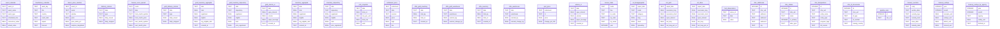

<!-- GENERATED FILE — do not hand-edit. Regenerate with:
     .venv/bin/python utils/gen_data_dictionary.py
     Source: backend/db.py's DDL (schema) + backend/sources.py (provenance/cadence/rate-limit)
     + frontend/src/data_editorial.js (per-field prose, where available). -->

# ArgentVigil Data Dictionary

40 tables. Generated field lists are mechanical (from SQLite's own schema); per-field descriptions are pulled from data_editorial.js where hand-written, or marked `<!-- TODO: describe field -->` where they are not yet documented.

## `census_trade`

**Source**: U.S. Census Bureau — International Trade (`census_trade`, gov_regulatory)  
**Cadence**: `interval`, every 604800s  
**Rate limit**: ~25-day minimum gap between fetch attempts  

| Field | Type | PK | Description |
|---|---|---|---|
| `metal` | TEXT | ✓ | PK — 'XAG' (HS 7106) or 'XAU' (HS 7108, comparison-only) |
| `flow` | TEXT | ✓ | PK — 'import' or 'export' |
| `hs_code` | TEXT | ✓ | PK — '7106' or '7108' |
| `cty_code` | TEXT | ✓ | PK — Census country code, '-' = all countries total |
| `cty_name` | TEXT |  | Country name |
| `year` | INTEGER | ✓ | PK |
| `month` | INTEGER | ✓ | PK |
| `value_general_usd` | INTEGER |  | Imports: GEN_VAL_MO (general import value). Exports: ALL_VAL_MO. |
| `value_consumption_usd` | INTEGER |  | Imports only, CON_VAL_MO (value for consumption — excludes bonded-warehouse/re-export flow). NULL for exports. |
| `qty` | REAL |  | Confirmed live (2025-01, 2024-06, both flows, both metals): always NULL today — Census reports no quantity/weight for HS 7106 or 7108 (GEN_QY1_MO/CON_QY1_MO/QTY_1_MO are always "0"). Not an error case; do not build oz-conversion logic against this field. |
| `qty_unit` | TEXT |  | Same confirmed-live gap as qty — always NULL today (UNIT_QY1 is always Census's '-' not-applicable sentinel for these two HS codes). |
| `fetched_at` | TEXT |  | Row upsert timestamp |

## `cot_disaggregated`

**Source**: CFTC Commitment of Traders (Legacy + Disaggregated) (`cot_pipeline`, gov_regulatory)  
**Cadence**: `manual_only`  
**Rate limit**: ~7-day minimum gap between fetch attempts  

| Field | Type | PK | Description |
|---|---|---|---|
| `report_date` | TEXT | ✓ | PK (with metal, category) — CFTC report date |
| `metal` | TEXT | ✓ | PK — 'silver' or 'gold' |
| `category` | TEXT | ✓ | PK — producer_merchant / swap_dealer / managed_money / other_reportable |
| `long` | REAL |  | Long contracts for this category |
| `short` | REAL |  | Short contracts for this category |
| `spreading` | REAL |  | Spread contracts (always NULL for producer_merchant — no spread field in CFTC's schema for that category) |
| `open_interest` | REAL |  | Total open interest for the report |

## `cot_gold`

**Source**: CFTC Commitment of Traders (Legacy + Disaggregated) (`cot_pipeline`, gov_regulatory)  
**Cadence**: `manual_only`  
**Rate limit**: ~7-day minimum gap between fetch attempts  

| Field | Type | PK | Description |
|---|---|---|---|
| `report_date` | TEXT | ✓ | PK — CFTC report date (Tuesday) |
| `noncomm_long` | REAL |  | Non-commercial (speculative) long contracts, gold futures |
| `noncomm_short` | REAL |  | Non-commercial (speculative) short contracts, gold futures |
| `open_interest` | REAL |  | Total gold futures open interest, contracts |
| `net_long` | REAL |  | noncomm_long - noncomm_short |
| `net_long_pct_oi` | REAL |  | net_long as % of open_interest |
| `fetched_at` | TEXT |  | Row insert timestamp (not report date) |

## `cot_silver`

**Source**: CFTC Commitment of Traders (Legacy + Disaggregated) (`cot_pipeline`, gov_regulatory)  
**Cadence**: `manual_only`  
**Rate limit**: ~7-day minimum gap between fetch attempts  

| Field | Type | PK | Description |
|---|---|---|---|
| `report_date` | TEXT | ✓ | PK — CFTC report date (Tuesday) |
| `noncomm_long` | REAL |  | Non-commercial (speculative) long contracts |
| `noncomm_short` | REAL |  | Non-commercial (speculative) short contracts |
| `open_interest` | REAL |  | Total open interest, contracts |
| `net_long` | REAL |  | noncomm_long - noncomm_short |
| `net_long_pct_oi` | REAL |  | net_long as % of open_interest |
| `fetched_at` | TEXT |  | Row insert timestamp (not report date) |

## `delivery_notices`

**Source**: Delivery Notices (`delivery_notices`, exchange_market)  
**Cadence**: `interval`, every 90000s  
**Rate limit**: undocumented — advisory only  

| Field | Type | PK | Description |
|---|---|---|---|
| `date` | TEXT | ✓ | PK (with type) |
| `type` | TEXT | ✓ | PK — 'mtd' or 'ytd' (Delivery Behavior uses ytd for ~85 days of coverage) |
| `daily_issued` | REAL |  | Delivery notices issued that day, contracts |
| `daily_stopped` | REAL |  | Delivery notices stopped that day, contracts |

## `event_calendar`

**Source**: CATCOR — Seed + Backfill Chain (`catcor_startup`, calendar_events)  
**Cadence**: `interval`, every 604800s  
**Rate limit**: undocumented — advisory only  

| Field | Type | PK | Description |
|---|---|---|---|
| `event_id` | TEXT | ✓ | PK — deterministic, f'{event_type}_{date}' |
| `event_name` | TEXT |  | Human label |
| `event_type` | TEXT |  | FOMC / CPI / NFP |
| `scheduled_time` | TEXT |  | Event datetime |
| `consensus_value` | REAL |  | From ForexFactory, current-week only |
| `actual_value` | REAL |  | From ALFRED |
| `surprise_delta` | REAL |  | actual - consensus, once both known |
| `source_url` | TEXT |  | Reference link |
| `source_tier` | TEXT |  | Currently always 'government' |

## `forexfactory_calendar`

**Source**: CATCOR — Seed + Backfill Chain (`catcor_startup`, calendar_events)  
**Cadence**: `interval`, every 604800s  
**Rate limit**: undocumented — advisory only  

| Field | Type | PK | Description |
|---|---|---|---|
| `week_key` | TEXT | ✓ | PK — that week's Sunday date |
| `title` | TEXT | ✓ | PK — event title, e.g. 'Non-Farm Employment Change' |
| `country` | TEXT | ✓ | PK — currency/country code |
| `event_date` | TEXT | ✓ | PK — scheduled date |
| `impact` | TEXT |  | Low/Medium/High |
| `forecast` | TEXT |  | Consensus forecast as given by the feed |
| `previous` | TEXT |  | Previous period's value |

## `fred_observations`

**Source**: FRED — Money Supply (M2, WALCL, Composition) (`money_supply`, gov_regulatory)  
**Cadence**: `interval`, every 604800s  
**Rate limit**: undocumented — advisory only  

| Field | Type | PK | Description |
|---|---|---|---|
| `series_id` | TEXT | ✓ | PK (with date) — one of 12 values, see the split-out rows below |
| `date` | TEXT | ✓ | PK — observation date |
| `value` | REAL |  | Series value in native FRED/upstream units — NOT normalized across series_id |

## `futures_curve_spread`

**Source**: Futures Curve Spread (`futures_curve_spread`, exchange_market)  
**Cadence**: `interval`, every 90000s  
**Rate limit**: undocumented — advisory only  

| Field | Type | PK | Description |
|---|---|---|---|
| `metal` | TEXT | ✓ | PK — 'XAG' or 'XAU' |
| `date` | TEXT | ✓ | PK |
| `front_month_symbol` | TEXT |  | Yahoo contract symbol picked as front month that day (e.g. 'SIU26.CMX') — highest real volume among probed candidates, not necessarily the nearest calendar month |
| `front_month_price` | REAL |  | Front-month daily settlement close, USD |
| `next_month_symbol` | TEXT |  | Second-highest-volume candidate's symbol |
| `next_month_price` | REAL |  | Next-month daily settlement close, USD |
| `curve_spread_pct` | REAL |  | (next_month_price - front_month_price) / front_month_price. Positive = contango, negative = backwardation. NULL (not 0) if either leg has no real price that day. |
| `fetched_at` | TEXT |  | Row upsert timestamp |

## `gold_delivery_notices`

**Source**: Gold Delivery Notices (`gold_delivery_notices`, exchange_market)  
**Cadence**: `interval`, every 90000s  
**Rate limit**: undocumented — advisory only  

| Field | Type | PK | Description |
|---|---|---|---|
| `date` | TEXT | ✓ | <!-- TODO: describe field --> |
| `type` | TEXT | ✓ | <!-- TODO: describe field --> |
| `daily_issued` | REAL |  | <!-- TODO: describe field --> |
| `daily_stopped` | REAL |  | <!-- TODO: describe field --> |

## `gold_inventory_aggregate`

**Source**: Comex Gold History (`comex_gold_history`, exchange_market)  
**Cadence**: `interval`, every 90000s  
**Rate limit**: undocumented — advisory only  

| Field | Type | PK | Description |
|---|---|---|---|
| `date` | TEXT | ✓ | <!-- TODO: describe field --> |
| `total` | REAL |  | <!-- TODO: describe field --> |
| `registered` | REAL |  | <!-- TODO: describe field --> |
| `eligible` | REAL |  | <!-- TODO: describe field --> |
| `reg_eligible_ratio` | REAL |  | <!-- TODO: describe field --> |
| `created_at` | TEXT |  | <!-- TODO: describe field --> |

## `gold_inventory_depository`

**Source**: Comex Gold Depositories (`comex_gold_depositories`, exchange_market)  
**Cadence**: `interval`, every 90000s  
**Rate limit**: undocumented — advisory only  

| Field | Type | PK | Description |
|---|---|---|---|
| `date` | TEXT | ✓ | <!-- TODO: describe field --> |
| `depository` | TEXT | ✓ | <!-- TODO: describe field --> |
| `registered` | REAL |  | <!-- TODO: describe field --> |
| `eligible` | REAL |  | <!-- TODO: describe field --> |
| `total` | REAL |  | <!-- TODO: describe field --> |
| `prev_registered` | REAL |  | <!-- TODO: describe field --> |
| `prev_eligible` | REAL |  | <!-- TODO: describe field --> |
| `prev_total` | REAL |  | <!-- TODO: describe field --> |

## `gold_volume_oi`

**Source**: Gold Leverage (`gold_leverage`, exchange_market)  
**Cadence**: `interval`, every 21600s  
**Rate limit**: undocumented — advisory only  

| Field | Type | PK | Description |
|---|---|---|---|
| `date` | TEXT | ✓ | <!-- TODO: describe field --> |
| `open_interest` | REAL |  | <!-- TODO: describe field --> |
| `volume` | REAL |  | <!-- TODO: describe field --> |
| `paper_leverage` | REAL |  | <!-- TODO: describe field --> |
| `created_at` | TEXT |  | <!-- TODO: describe field --> |

## `interval_overrides`

**Source**: infrastructure table (no registered upstream source)  

| Field | Type | PK | Description |
|---|---|---|---|
| `source_key` | TEXT | ✓ | <!-- TODO: describe field --> |
| `interval_seconds` | INTEGER |  | <!-- TODO: describe field --> |

## `inventory_aggregate`

**Source**: Comex Silver History (`comex_silver_history`, exchange_market)  
**Cadence**: `interval`, every 90000s  
**Rate limit**: undocumented — advisory only  

| Field | Type | PK | Description |
|---|---|---|---|
| `date` | TEXT | ✓ | PK |
| `total` | REAL |  | Total COMEX silver vault holdings, troy oz |
| `registered` | REAL |  | Registered (deliverable) oz |
| `eligible` | REAL |  | Eligible (non-deliverable) oz |
| `reg_eligible_ratio` | REAL |  | registered / eligible |
| `created_at` | TEXT |  | Row insert timestamp |

## `inventory_depository`

**Source**: Comex Silver Depositories (`comex_silver_depositories`, exchange_market)  
**Cadence**: `interval`, every 90000s  
**Rate limit**: undocumented — advisory only  

| Field | Type | PK | Description |
|---|---|---|---|
| `date` | TEXT | ✓ | PK (with depository) |
| `depository` | TEXT | ✓ | PK — vault name, e.g. 'JPMorgan' |
| `registered` | REAL |  | This vault's registered oz |
| `eligible` | REAL |  | This vault's eligible oz |
| `total` | REAL |  | This vault's total oz |
| `prev_registered` | REAL |  | <!-- TODO: describe field --> |
| `prev_eligible` | REAL |  | <!-- TODO: describe field --> |
| `prev_total` | REAL |  | <!-- TODO: describe field --> |

## `macro_price_reaction`

**Source**: CATCOR — Seed + Backfill Chain (`catcor_startup`, calendar_events)  
**Cadence**: `interval`, every 604800s  
**Rate limit**: undocumented — advisory only  

| Field | Type | PK | Description |
|---|---|---|---|
| `event_id` | TEXT | ✓ | PK (with metal, window) |
| `metal` | TEXT | ✓ | PK — XAG or XAU |
| `window` | TEXT | ✓ | PK — T-30m / T+5m / T+30m / T+2h |
| `price` | REAL |  | Captured price at that window |
| `price_delta_pct` | REAL |  | % change vs. pre-event price |
| `surprise_magnitude` | REAL |  | Copied from event's surprise_delta at capture time |

## `ofac_addresses`

**Source**: OFAC — Sanctions List Service (SDN + Consolidated) (`ofac_sanctions`, gov_regulatory)  
**Cadence**: `interval`, every 90000s  
**Rate limit**: undocumented — advisory only  

| Field | Type | PK | Description |
|---|---|---|---|
| `id` | INTEGER | ✓ | PK, autoincrement |
| `ofac_uid` | TEXT |  | FK to ofac_designations.ofac_uid (not enforced). |
| `address1` | TEXT |  | <!-- TODO: describe field --> |
| `address2` | TEXT |  | <!-- TODO: describe field --> |
| `address3` | TEXT |  | <!-- TODO: describe field --> |
| `city` | TEXT |  | <!-- TODO: describe field --> |
| `state_province` | TEXT |  | <!-- TODO: describe field --> |
| `postal_code` | TEXT |  | <!-- TODO: describe field --> |
| `country` | TEXT |  | Resolved from the Location's own LocationCountry/@CountryID via the CountryValues lookup — not a raw ID. |

## `ofac_aliases`

**Source**: OFAC — Sanctions List Service (SDN + Consolidated) (`ofac_sanctions`, gov_regulatory)  
**Cadence**: `interval`, every 90000s  
**Rate limit**: undocumented — advisory only  

| Field | Type | PK | Description |
|---|---|---|---|
| `id` | INTEGER | ✓ | PK, autoincrement |
| `ofac_uid` | TEXT |  | FK to ofac_designations.ofac_uid (not enforced — this codebase's sqlite3 connections don't turn on PRAGMA foreign_keys, same as every other table here). |
| `name` | TEXT |  | One alias name — confirmed live an entity can carry several (A.K.A./F.K.A./N.K.A. plus the primary 'Name' entry); this table holds ALL of them, not just the one ofac_designations.entity_name picks. |
| `is_primary` | INTEGER |  | 1 for the alias ofac_designations.entity_name was assembled from, 0 otherwise. |
| `alias_type` | TEXT |  | AliasTypeValues' own label — confirmed live only 4 values exist in this data: A.K.A., F.K.A., N.K.A., Name. |

## `ofac_designations`

**Source**: OFAC — Sanctions List Service (SDN + Consolidated) (`ofac_sanctions`, gov_regulatory)  
**Cadence**: `interval`, every 90000s  
**Rate limit**: undocumented — advisory only  

| Field | Type | PK | Description |
|---|---|---|---|
| `id` | INTEGER | ✓ | PK, autoincrement |
| `ofac_uid` | TEXT |  | OFAC's own internal entity identifier (Profile/@ID under the Advanced XML parse) — the diff/join key, unique. Never re-derived from name matching. |
| `entity_name` | TEXT |  | Primary published name, assembled from the primary Alias's DocumentedName/DocumentedNamePart/NamePartValue chain (falls back to the first Alias present if none is marked Primary, confirmed live this happens on some real entries). |
| `entity_type` | TEXT |  | individual / entity / vessel / aircraft — resolved via PartySubTypeID (1/2 map directly to vessel/aircraft; 3/4, both labeled 'Unknown' in PartySubTypeValues, resolve via that subtype's own PartyTypeID attribute — a real bug caught mid-build: an early version defaulted 3/4 to 'entity' unconditionally, silently misclassifying every real Individual). Captured now even though the frontend renders one marker type for all types at launch (sanctionsTimeline-spec.md Story #3) — a future marker-type breakout is a display-time filter against data already here, not new ingestion work. |
| `program_tags` | TEXT |  | JSON array of OFAC program strings (e.g. IRAN, RUSSIA-EO14024, SDGT) — an entity can carry more than one. Sourced from SanctionsMeasure elements with SanctionsTypeID=1 ('Program'), whose own Comment element carries the program name directly (confirmed live, e.g. <Comment>CUBA</Comment>) — NOT a separate ID-linked table the way the plain files' <program> elements are. Stored as TEXT, encoded/decoded at the db.py boundary. |
| `list_source` | TEXT |  | 'SDN' or 'Consolidated' — confirmed live these are genuinely separate lists, not a superset/subset naming quirk. |
| `designation_date` | TEXT |  | A real per-entity date, sourced from SanctionsEntry/EntryEvent/Date filtered to EntryEventTypeID=1 ('Created' per EntryEventTypeValues — confirmed live the only EntryEventType value that exists in this data). Confirmed live on real entries back to 1981-01-07. The EARLIEST such date across all of a profile's SanctionsEntry rows is kept, if it has more than one (multiple lists). Still nullable in principle and never backfilled from a fallback when genuinely absent, per nulls-over-zeros — but the common case is now a real date, correcting this feature's original ship (which used the plain, non-Advanced XML files and had no per-entity date source at all). |
| `legal_basis` | TEXT |  | 2026-08-27 follow-up. A real, mostly-populated (confirmed live: 91.5% of a full fetch, 18,031/19,707) human-readable legal authority string (e.g. 'Executive Order 14024 (Russia)'), sourced from that SAME EntryEvent's own LegalBasisID (resolved via LegalBasisValues), tracked alongside designation_date on the same earliest-EntryEvent-wins basis. NULL when the source resolves to the dictionary's own 'Unknown' placeholder, never the literal string. Confirmed live that OFAC's own LegalBasis->SanctionsProgram link is broken (every LegalBasis element's SanctionsProgramID points at 'Unknown' regardless of real subject) — this field is per-designation context, not a working per-program reference; no per-program detail page exists in this data. |
| `vessel_flag` | TEXT |  | Nullable, populated only when entity_type = vessel (flag state). Sourced from Feature/FeatureVersion matched by FeatureTypeID=3; the value is either inline text or a DetailReferenceID pointer needing a lookup (see vessel_type). |
| `vessel_type` | TEXT |  | Nullable, populated only when entity_type = vessel (e.g. Tug, Tanker). FeatureTypeID=2; confirmed live some real values arrive as a DetailReferenceID pointer rather than inline text (e.g. DetailReferenceID=705 resolves to 'Tug' via the ReferenceValueSets/DetailReferenceValues lookup), not always a plain string. |
| `first_seen_snapshot_date` | TEXT |  | Date this entity first appeared in AV's own daily pull — the fallback chart-placement anchor for the rare row without a real designation_date; GET /api/ofac/db's chart_date field (COALESCE(designation_date, first_seen_snapshot_date)) is what the frontend actually reads. |
| `last_seen_snapshot_date` | TEXT |  | Most recent daily pull the entity was still present in. Bumped on every re-seen entity, alongside a one-time backfill of designation_date/entity_name/program_tags/vessel_flag/vessel_type whenever the persisted value is NULL/empty and today's pull has a real one — this converges older rows to real data without becoming ongoing content-diffing (an already-real field is never overwritten). |
| `delisted_date` | TEXT |  | Nullable — set when an entity present in a prior pull is absent from the current one. A state change on the existing row, never a new row, never a deletion. Cleared again if the same uid is later re-listed. |
| `created_at` | TEXT |  | <!-- TODO: describe field --> |
| `updated_at` | TEXT |  | <!-- TODO: describe field --> |

## `ofac_id_documents`

**Source**: OFAC — Sanctions List Service (SDN + Consolidated) (`ofac_sanctions`, gov_regulatory)  
**Cadence**: `interval`, every 90000s  
**Rate limit**: undocumented — advisory only  

| Field | Type | PK | Description |
|---|---|---|---|
| `id` | INTEGER | ✓ | PK, autoincrement |
| `ofac_uid` | TEXT |  | FK to ofac_designations.ofac_uid (not enforced). |
| `id_type` | TEXT |  | IDRegDocTypeValues' own label — e.g. Passport, SSN, Cedula No., Driver's License No., R.F.C., D.N.I. |
| `id_number` | TEXT |  | The document's own registration number (IDRegistrationNo). |
| `issuing_country` | TEXT |  | Resolved from the document's own IssuedBy-CountryID via the same CountryValues lookup addresses use. |

## `pipeline_runs`

**Source**: CFTC Commitment of Traders (Legacy + Disaggregated) (`cot_pipeline`, gov_regulatory)  
**Cadence**: `manual_only`  
**Rate limit**: ~7-day minimum gap between fetch attempts  

| Field | Type | PK | Description |
|---|---|---|---|
| `id` | INTEGER | ✓ | Always 1 — single-row table |
| `ran_at` | TEXT |  | Timestamp of the last completed pipeline/run.py run |

## `pslv_snapshot`

**Source**: Pslv (`pslv`, exchange_market)  
**Cadence**: `interval`, every 90000s  
**Rate limit**: undocumented — advisory only  

| Field | Type | PK | Description |
|---|---|---|---|
| `date` | TEXT | ✓ | PK |
| `total_oz` | REAL |  | PSLV trust's total silver holdings, oz |
| `nav_per_unit` | REAL |  | Net asset value per unit |
| `total_nav` | REAL |  | Total NAV |
| `units` | REAL |  | Units outstanding |

## `research_log`

**Source**: infrastructure table (no registered upstream source)  

| Field | Type | PK | Description |
|---|---|---|---|
| `id` | INTEGER | ✓ | PK, autoincrement |
| `session_id` | TEXT |  | FK -> research_sessions |
| `claim_text` | TEXT |  | Denormalized copy from the session |
| `source_url` | TEXT |  | Optional |
| `user_read` | TEXT |  | bullish | bearish | neutral |
| `dismissed_at` | TEXT |  | ISO timestamp |
| `dismiss_reason` | TEXT |  | Required, non-empty — why this claim didn't hold up |
| `validation_status` | TEXT |  | correct | incorrect | mixed — reserved for a later validation pass, always NULL today |

## `research_messages`

**Source**: infrastructure table (no registered upstream source)  

| Field | Type | PK | Description |
|---|---|---|---|
| `id` | INTEGER | ✓ | PK, autoincrement |
| `session_id` | TEXT |  | FK -> research_sessions |
| `role` | TEXT |  | user | assistant |
| `content` | TEXT |  | Raw turn text (user) or a small JSON envelope {"final_text": ...} (assistant) |
| `created_at` | TEXT |  | ISO timestamp, preserves ordering |
| `backend` | TEXT |  | assistant rows only — 'anthropic' | 'forge', which backend answered |
| `model` | TEXT |  | assistant rows only — resolved model string actually used |
| `persona` | TEXT |  | assistant rows only — persona filename stem active for this turn |
| `context_blocks` | TEXT |  | user rows only — JSON array of the context blocks checked for this turn |
| `memory_mode` | TEXT |  | user rows only — stateless | accumulating, the mode this turn was sent under |
| `memory_changed` | INTEGER |  | user rows only — 1 if this turn's memory_mode differs from the session's previous turn, else 0; drives the transcript's memory-switch divider |
| `assembled_prompt` | TEXT |  | user rows only — the exact system+messages payload sent to the model, for transcript replay |

## `research_sessions`

**Source**: infrastructure table (no registered upstream source)  

| Field | Type | PK | Description |
|---|---|---|---|
| `session_id` | TEXT | ✓ | PK — UUID |
| `claim_text` | TEXT |  | The pasted claim/first message, as originally entered |
| `source_url` | TEXT |  | Optional |
| `status` | TEXT |  | active | promoted | dismissed — discarded sessions are deleted outright, never a 4th stored value |
| `user_read` | TEXT |  | bullish | bearish | neutral — settable via POST .../read |
| `memory_mode` | TEXT |  | stateless | accumulating — the session's current setting, defaults to accumulating; used to default the turn composer's toggle to wherever it was left |
| `created_at` | TEXT |  | ISO timestamp |
| `updated_at` | TEXT |  | Bumped on every message |

## `settlement_price`

**Source**: Yahoo Finance — Daily Metal Closes (`metals_prices`, exchange_market)  
**Cadence**: `interval`, every 90000s  
**Rate limit**: undocumented — advisory only  

| Field | Type | PK | Description |
|---|---|---|---|
| `instrument` | TEXT | ✓ | <!-- TODO: describe field --> |
| `date` | TEXT | ✓ | <!-- TODO: describe field --> |
| `session` | TEXT | ✓ | <!-- TODO: describe field --> |
| `price` | REAL |  | <!-- TODO: describe field --> |
| `high` | REAL |  | <!-- TODO: describe field --> |
| `low` | REAL |  | <!-- TODO: describe field --> |
| `fetched_at` | TEXT |  | <!-- TODO: describe field --> |

## `shfe_gold_inventory`

**Source**: Shfe Gold History (`shfe_gold_history`, exchange_market)  
**Cadence**: `interval`, every 90000s  
**Rate limit**: undocumented — advisory only  

| Field | Type | PK | Description |
|---|---|---|---|
| `date` | TEXT | ✓ | <!-- TODO: describe field --> |
| `total_kg` | REAL |  | <!-- TODO: describe field --> |
| `total_oz` | REAL |  | <!-- TODO: describe field --> |
| `created_at` | TEXT |  | <!-- TODO: describe field --> |

## `shfe_gold_warehouse`

**Source**: Shfe Gold Warehouses (`shfe_gold_warehouses`, exchange_market)  
**Cadence**: `interval`, every 90000s  
**Rate limit**: undocumented — advisory only  

| Field | Type | PK | Description |
|---|---|---|---|
| `date` | TEXT | ✓ | <!-- TODO: describe field --> |
| `warehouse` | TEXT | ✓ | <!-- TODO: describe field --> |
| `warrant_kg` | REAL |  | <!-- TODO: describe field --> |
| `warrant_change_kg` | REAL |  | <!-- TODO: describe field --> |

## `shfe_inventory`

**Source**: Shfe Silver History (`shfe_silver_history`, exchange_market)  
**Cadence**: `interval`, every 90000s  
**Rate limit**: undocumented — advisory only  

| Field | Type | PK | Description |
|---|---|---|---|
| `date` | TEXT | ✓ | PK |
| `total_kg` | REAL |  | Total SHFE silver warehouse stock, kg (native unit) |
| `total_oz` | REAL |  | Converted, 1 kg = 32.1507 oz |
| `created_at` | TEXT |  | <!-- TODO: describe field --> |

## `shfe_warehouse`

**Source**: Shfe Warehouses (`shfe_warehouses`, exchange_market)  
**Cadence**: `interval`, every 90000s  
**Rate limit**: undocumented — advisory only  

| Field | Type | PK | Description |
|---|---|---|---|
| `date` | TEXT | ✓ | PK (with warehouse) |
| `warehouse` | TEXT | ✓ | PK — individual SHFE warehouse name |
| `warrant_kg` | REAL |  | Warrant stock at this warehouse, kg |
| `warrant_change_kg` | REAL |  | Day-over-day change, kg |

## `source_health`

**Source**: infrastructure table (no registered upstream source)  

| Field | Type | PK | Description |
|---|---|---|---|
| `source_key` | TEXT | ✓ | <!-- TODO: describe field --> |
| `last_attempt_at` | TEXT |  | <!-- TODO: describe field --> |
| `last_attempt_status` | TEXT |  | <!-- TODO: describe field --> |
| `last_success_at` | TEXT |  | <!-- TODO: describe field --> |
| `last_error` | TEXT |  | <!-- TODO: describe field --> |
| `consecutive_failures` | INTEGER |  | <!-- TODO: describe field --> |

## `spot_price`

**Source**: Spot Prices (metalcharts.org) (`spot_prices`, exchange_market)  
**Cadence**: `interval`, every 60s  
**Rate limit**: undocumented — advisory only  

| Field | Type | PK | Description |
|---|---|---|---|
| `instrument` | TEXT | ✓ | PK (with ts) — XAG_SPOT/XAU_SPOT (real metalcharts.org spot ticks, this card's source) or XAG_FUTURES_FRONT/XAU_FUTURES_FRONT (Yahoo SI=F/GC=F front-month-continuous futures bars, a different instrument backfilled by CATCOR — see the catcor_reactions card). A closed instrument set (backend/price_instruments.py) so these can never collide under one key. |
| `ts` | TEXT | ✓ | PK — timestamp of this tick |
| `price` | REAL |  | Price at that tick |
| `change_pct_24h` | REAL |  | 24h % change, from upstream — only ever populated for *_SPOT rows (metalcharts.org supplies it for free on every poll; Yahoo futures bars carry no equivalent field, so *_FUTURES_FRONT rows leave this NULL) |

## `sqlite_sequence`

**Source**: infrastructure table (no registered upstream source)  

| Field | Type | PK | Description |
|---|---|---|---|
| `name` |  |  | <!-- TODO: describe field --> |
| `seq` |  |  | <!-- TODO: describe field --> |

## `squeeze_case_log`

**Source**: infrastructure table (no registered upstream source)  

| Field | Type | PK | Description |
|---|---|---|---|
| `id` | INTEGER | ✓ | PK, autoincrement |
| `event_name` | TEXT |  | Human label, e.g. '2011 Silver Blow-off' |
| `metal` | TEXT |  | silver / gold |
| `date_range_start` | TEXT |  | <!-- TODO: describe field --> |
| `date_range_end` | TEXT |  | <!-- TODO: describe field --> |
| `cot_reading_snapshot` | TEXT |  | Free text/small JSON — MM net-long %ile at relevant points, hand-recorded |
| `curve_reading_snapshot` | TEXT |  | Free text/small JSON, nullable — curve spread at relevant points, where backfill data was obtainable (best-effort, not guaranteed for cases predating futures_curve_spread's own ingestion start) |
| `mechanism_tag` | TEXT |  | e.g. 'squeeze', 'liquidity_panic', 'other' — 2020 gold is a different mechanism than 2011/2026 silver and is not conflated with it |
| `outcome_notes` | TEXT |  | Free text description of what actually happened to price after — descriptive, not predictive framing, per AV Voice Rules |
| `created_at` | TEXT |  | <!-- TODO: describe field --> |
| `updated_at` | TEXT |  | <!-- TODO: describe field --> |

## `treasury_auctions`

**Source**: U.S. Treasury — Auction Results (`treasury_auctions`, gov_regulatory)  
**Cadence**: `interval`, every 86400s  
**Rate limit**: undocumented — advisory only  

| Field | Type | PK | Description |
|---|---|---|---|
| `cusip` | TEXT | ✓ | PK — the specific security's CUSIP identifier. |
| `auction_date` | TEXT | ✓ | PK — the date this security was auctioned. |
| `security_type` | TEXT |  | 'Bill' / 'Note' / 'Bond' / 'TIPS' / 'FRN' — charted separately, since bid-to-cover/yield scales aren't comparable across types. |
| `security_term` | TEXT |  | e.g. '2-Year', '52-Week', '10-Year' — the security's stated term. |
| `issue_date` | TEXT |  | When the security was actually issued (a few days after auction_date). |
| `maturity_date` | TEXT |  | When the security matures. |
| `high_yield` | REAL |  | The highest (worst-price) yield accepted at auction, percent. NULL until settlement. |
| `high_discnt_rate` | REAL |  | Bills only — the discount-basis equivalent of high_yield. NULL for coupon securities and until settlement. |
| `high_investment_rate` | REAL |  | Bills only — the investment-rate (bond-equivalent) form of the discount rate. NULL for coupon securities and until settlement. |
| `bid_to_cover_ratio` | REAL |  | Total bids tendered ÷ total accepted — demand strength for this specific auction. NULL until settlement. |
| `offering_amt` | REAL |  | USD amount Treasury offered at this auction. |
| `total_tendered` | REAL |  | USD amount of all bids submitted. NULL until settlement. |
| `total_accepted` | REAL |  | USD amount actually awarded — should be close to offering_amt. NULL until settlement. |
| `indirect_bidder_tendered` | REAL |  | <!-- TODO: describe field --> |
| `indirect_bidder_accepted` | REAL |  | <!-- TODO: describe field --> |
| `direct_bidder_tendered` | REAL |  | <!-- TODO: describe field --> |
| `direct_bidder_accepted` | REAL |  | <!-- TODO: describe field --> |
| `primary_dealer_tendered` | REAL |  | <!-- TODO: describe field --> |
| `primary_dealer_accepted` | REAL |  | <!-- TODO: describe field --> |
| `soma_tendered` | REAL |  | <!-- TODO: describe field --> |
| `soma_accepted` | REAL |  | <!-- TODO: describe field --> |
| `soma_holdings` | REAL |  | SOMA's total holdings of this specific maturing/related security as of the auction, separate from soma_tendered/accepted at this auction itself. |
| `fetched_at` | TEXT |  | <!-- TODO: describe field --> |

## `treasury_outlays`

**Source**: U.S. Treasury — Monthly Treasury Statement (`treasury_outlays`, gov_regulatory)  
**Cadence**: `interval`, every 2678400s  
**Rate limit**: undocumented — advisory only  

| Field | Type | PK | Description |
|---|---|---|---|
| `year` | INTEGER | ✓ | PK — real calendar year, reconstructed from Table 1's classification_desc (month name) + sequence_number_cd's fiscal-year-block prefix ('1.'=prior FY, '2.'=current FY); NOT the same as any single row's own record_fiscal_year field, which is the REPORT's own FY on every row regardless of block. |
| `month` | INTEGER | ✓ | PK — real calendar month (1-12), same reconstruction as year. |
| `receipts_usd` | REAL |  | Table 1 current_month_gross_rcpt_amt for this real month. |
| `outlays_usd` | REAL |  | Table 1 current_month_gross_outly_amt for this real month. |
| `deficit_usd` | REAL |  | Table 1 current_month_dfct_sur_amt for this real month — reported directly by Treasury, not derived from receipts − outlays client-side. |
| `interest_usd` | REAL |  | Table 5's "Total--Interest on the Public Debt" row, current_month_net_outly_amt, matched to this real month via that row's own record_date (Table 5 has no fiscal-year-block ambiguity for this classification — confirmed live, one real row per record_date, already that single month's own figure despite the field name's "current_month" ambiguity next to a sibling current_fytd_net_outly_amt column). |
| `fetched_at` | TEXT |  | Row upsert timestamp |

## `treasury_outlays_by_agency`

**Source**: U.S. Treasury — MTS Outlays by Department/Agency (`treasury_outlays_by_agency`, gov_regulatory)  
**Cadence**: `interval`, every 2678400s  
**Rate limit**: undocumented — advisory only  

| Field | Type | PK | Description |
|---|---|---|---|
| `year` | INTEGER | ✓ | PK — real calendar year, taken directly from that record_date's own year (Table 5's per-date rows have no fiscal-year-block ambiguity for this classification — unlike Table 1's month reconstruction). |
| `month` | INTEGER | ✓ | PK — real calendar month, same source as year. |
| `agency` | TEXT | ✓ | PK — department/agency name (Table 5's level-1 header classification_desc, colon-stripped, e.g. "Department of Defense--Military Programs"). Confirmed stable 29-entry list across 2015 and 2026. |
| `outlay_usd` | REAL |  | That department's Treasury-reported "Total--<agency>" monthly figure. Can be legitimately negative (offsetting receipts exceeding gross outlays that month) — confirmed live for several agencies (e.g. Department of Education, Independent Agencies) — not an error case. |
| `fetched_at` | TEXT |  | Row upsert timestamp |

## `ui_settings`

**Source**: infrastructure table (no registered upstream source)  

| Field | Type | PK | Description |
|---|---|---|---|
| `id` | INTEGER | ✓ | <!-- TODO: describe field --> |
| `pinned_section` | TEXT |  | <!-- TODO: describe field --> |
| `refresh_enabled` | INTEGER |  | <!-- TODO: describe field --> |

## `volume_oi`

**Source**: Silver Leverage (`silver_leverage`, exchange_market)  
**Cadence**: `interval`, every 21600s  
**Rate limit**: undocumented — advisory only  

| Field | Type | PK | Description |
|---|---|---|---|
| `date` | TEXT | ✓ | PK |
| `open_interest` | REAL |  | COMEX silver open interest, contracts |
| `volume` | REAL |  | Daily volume, contracts |
| `paper_leverage` | REAL |  | Derived ratio, powers Paper Leverage cards |
| `created_at` | TEXT |  | <!-- TODO: describe field --> |

---

**Coverage**: 190/267 fields documented, 77 pending (`<!-- TODO: describe field -->`).

## Entity groups (by affinity group)

```mermaid
erDiagram
    "event_calendar" {
        TEXT event_id
        TEXT event_name
        TEXT event_type
        TEXT scheduled_time
        REAL consensus_value
        REAL actual_value
    }
    "forexfactory_calendar" {
        TEXT week_key
        TEXT title
        TEXT country
        TEXT event_date
        TEXT impact
        TEXT forecast
    }
    "macro_price_reaction" {
        TEXT event_id
        TEXT metal
        TEXT window
        REAL price
        REAL price_delta_pct
        REAL surprise_magnitude
    }
    "delivery_notices" {
        TEXT date
        TEXT type
        REAL daily_issued
        REAL daily_stopped
    }
    "futures_curve_spread" {
        TEXT metal
        TEXT date
        TEXT front_month_symbol
        REAL front_month_price
        TEXT next_month_symbol
        REAL next_month_price
    }
    "gold_delivery_notices" {
        TEXT date
        TEXT type
        REAL daily_issued
        REAL daily_stopped
    }
    "gold_inventory_aggregate" {
        TEXT date
        REAL total
        REAL registered
        REAL eligible
        REAL reg_eligible_ratio
        TEXT created_at
    }
    "gold_inventory_depository" {
        TEXT date
        TEXT depository
        REAL registered
        REAL eligible
        REAL total
        REAL prev_registered
    }
    "gold_volume_oi" {
        TEXT date
        REAL open_interest
        REAL volume
        REAL paper_leverage
        TEXT created_at
    }
    "inventory_aggregate" {
        TEXT date
        REAL total
        REAL registered
        REAL eligible
        REAL reg_eligible_ratio
        TEXT created_at
    }
    "inventory_depository" {
        TEXT date
        TEXT depository
        REAL registered
        REAL eligible
        REAL total
        REAL prev_registered
    }
    "pslv_snapshot" {
        TEXT date
        REAL total_oz
        REAL nav_per_unit
        REAL total_nav
        REAL units
    }
    "settlement_price" {
        TEXT instrument
        TEXT date
        TEXT session
        REAL price
        REAL high
        REAL low
    }
    "shfe_gold_inventory" {
        TEXT date
        REAL total_kg
        REAL total_oz
        TEXT created_at
    }
    "shfe_gold_warehouse" {
        TEXT date
        TEXT warehouse
        REAL warrant_kg
        REAL warrant_change_kg
    }
    "shfe_inventory" {
        TEXT date
        REAL total_kg
        REAL total_oz
        TEXT created_at
    }
    "shfe_warehouse" {
        TEXT date
        TEXT warehouse
        REAL warrant_kg
        REAL warrant_change_kg
    }
    "spot_price" {
        TEXT instrument
        TEXT ts
        REAL price
        REAL change_pct_24h
    }
    "volume_oi" {
        TEXT date
        REAL open_interest
        REAL volume
        REAL paper_leverage
        TEXT created_at
    }
    "census_trade" {
        TEXT metal
        TEXT flow
        TEXT hs_code
        TEXT cty_code
        TEXT cty_name
        INTEGER year
    }
    "cot_disaggregated" {
        TEXT report_date
        TEXT metal
        TEXT category
        REAL long
        REAL short
        REAL spreading
    }
    "cot_gold" {
        TEXT report_date
        REAL noncomm_long
        REAL noncomm_short
        REAL open_interest
        REAL net_long
        REAL net_long_pct_oi
    }
    "cot_silver" {
        TEXT report_date
        REAL noncomm_long
        REAL noncomm_short
        REAL open_interest
        REAL net_long
        REAL net_long_pct_oi
    }
    "fred_observations" {
        TEXT series_id
        TEXT date
        REAL value
    }
    "ofac_addresses" {
        INTEGER id
        TEXT ofac_uid
        TEXT address1
        TEXT address2
        TEXT address3
        TEXT city
    }
    "ofac_aliases" {
        INTEGER id
        TEXT ofac_uid
        TEXT name
        INTEGER is_primary
        TEXT alias_type
    }
    "ofac_designations" {
        INTEGER id
        TEXT ofac_uid
        TEXT entity_name
        TEXT entity_type
        TEXT program_tags
        TEXT list_source
    }
    "ofac_id_documents" {
        INTEGER id
        TEXT ofac_uid
        TEXT id_type
        TEXT id_number
        TEXT issuing_country
    }
    "pipeline_runs" {
        INTEGER id
        TEXT ran_at
    }
    "treasury_auctions" {
        TEXT cusip
        TEXT auction_date
        TEXT security_type
        TEXT security_term
        TEXT issue_date
        TEXT maturity_date
    }
    "treasury_outlays" {
        INTEGER year
        INTEGER month
        REAL receipts_usd
        REAL outlays_usd
        REAL deficit_usd
        REAL interest_usd
    }
    "treasury_outlays_by_agency" {
        INTEGER year
        INTEGER month
        TEXT agency
        REAL outlay_usd
        TEXT fetched_at
    }
```

Infrastructure tables (no registered source): `interval_overrides`, `research_log`, `research_messages`, `research_sessions`, `source_health`, `sqlite_sequence`, `squeeze_case_log`, `ui_settings`